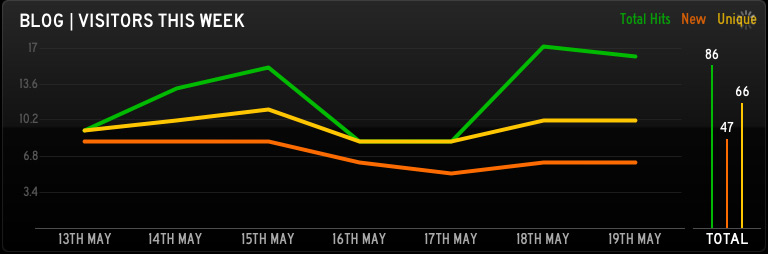
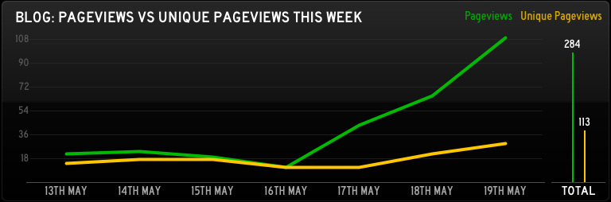

google-analytics-statusboard
============================

Written in PHP Using Zend GData via Composer

### Visitors Panel

### Pageviews Panel

### Instructions
Install via Composer 

    composer install
    
Add your own email, password and profile id.

Upload to a server, enjoy!

### Further Reading

You can read more about this on my [blog](http://blog.eoghanobrien.com/post/50898130934/google-analytics-for-statusboard-with-php)
